# ReelDrama — OTT Mobile Application

A cross-platform (Android/iOS) OTT streaming mobile app built with React Native (Expo) and TypeScript. Features OTP-based authentication, a dynamic content feed, a full Movie → Series → Season → Episode content hierarchy, and a custom video player with HLS streaming, DRM-protected playback, landscape mode, and resume-from-last-position support.

## Screenshots

### Authentication

| Splash Screen | Login | OTP Verification |
|---|---|---|
| 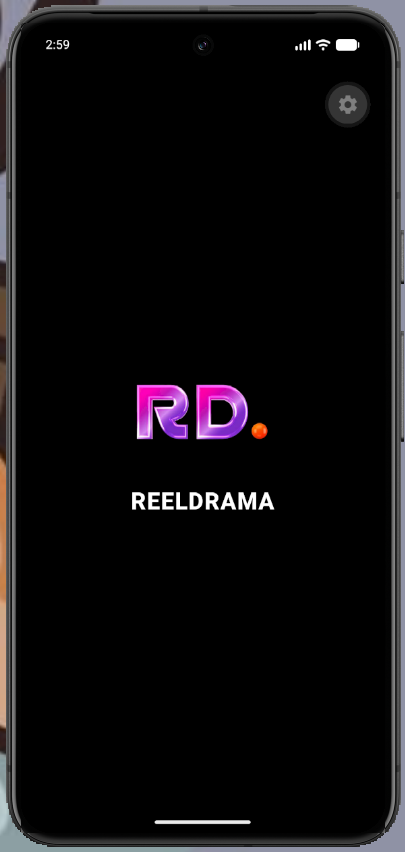 | 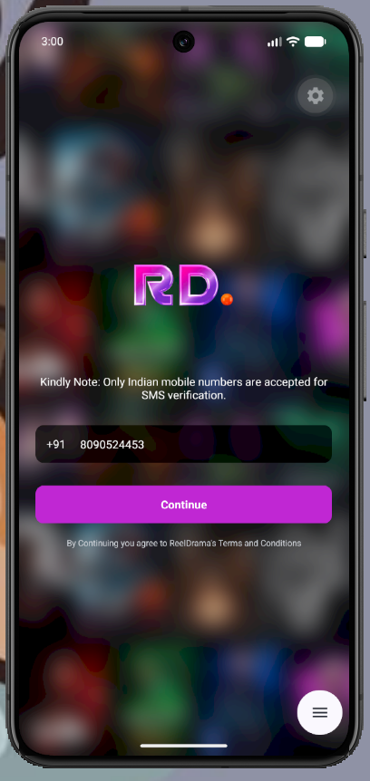 | 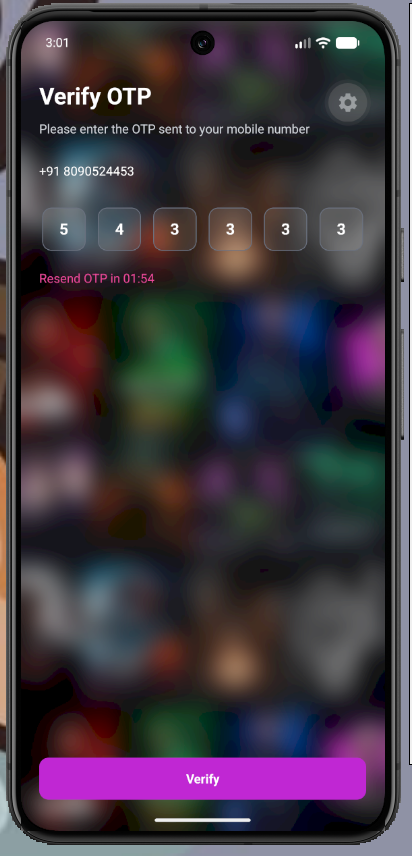 |

### Home Feed

| Carousel | Shows Tab | Top 10 Ranked |
|---|---|---|
| 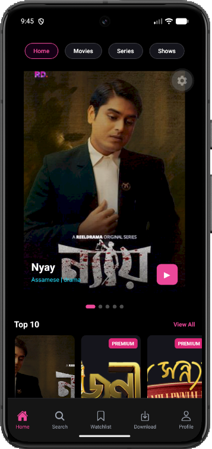 |  | 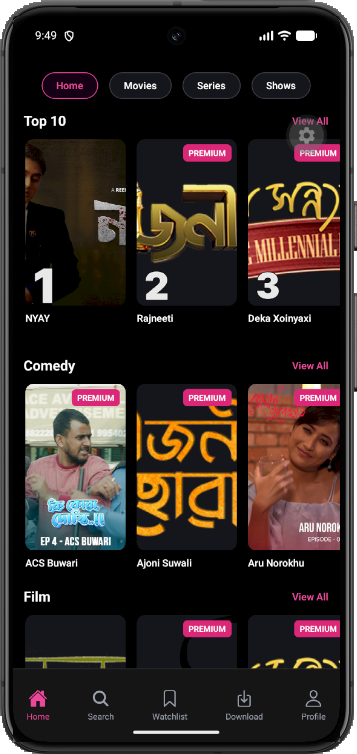 |

| Continue Watching | Logout |
|---|---|
| 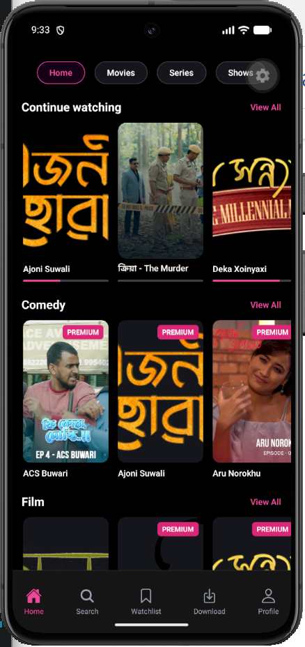 | 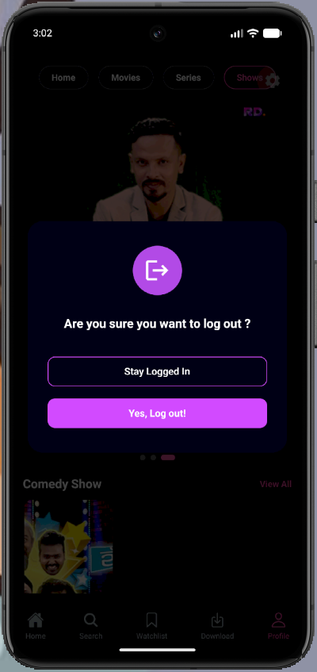 |

### Series Navigation

| Season Selection | Episode List |
|---|---|
| 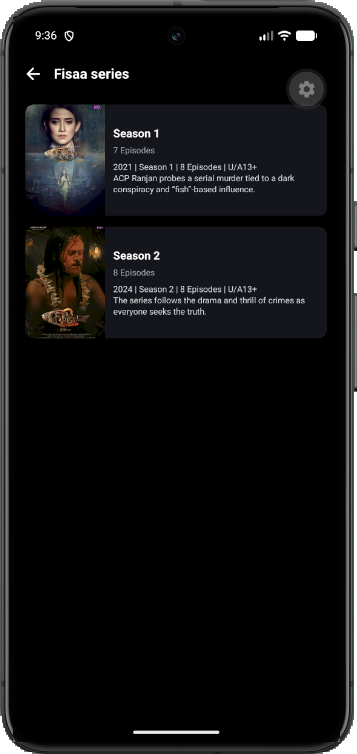 | 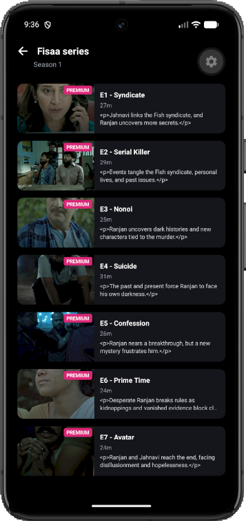 |

### Video Player

| Portrait (Controls) | Portrait (Details) | Landscape (Fullscreen) |
|---|---|---|
| 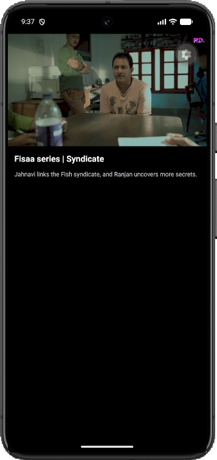 | 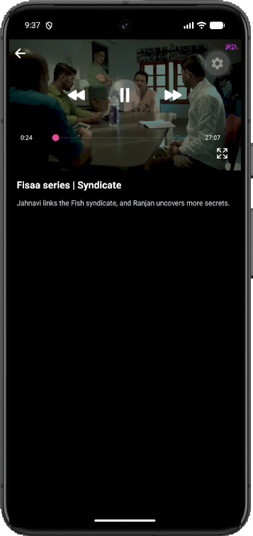 | 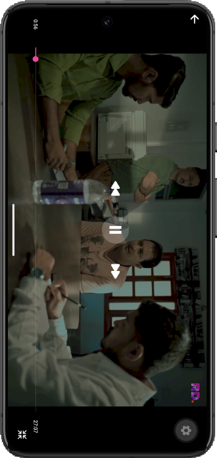 |

## Tech Stack

- **React Native (Expo)** + **TypeScript**
- **NativeWind** (Tailwind CSS for React Native)
- **React Navigation** (native-stack)
- **TanStack React Query** — data fetching, caching, and mutations
- **Axios** — HTTP client
- **react-native-video** — HLS streaming with Widevine/FairPlay DRM support
- **expo-image**, **expo-screen-orientation**, **@react-native-community/slider**
- **AsyncStorage** — local token persistence
- **EAS Build** — custom native dev client (required for DRM/video native modules, which Expo Go does not support)

## Features

### Authentication
- OTP-based login flow using an Indian mobile number
- Anonymous device token issued before login, replaced with a user token on successful OTP verification
- 2-minute resend timer with live countdown
- Session persistence via AsyncStorage — no re-login needed between app launches
- Logout with confirmation modal

### Home Feed
- Auto-playing banner carousel with pagination dots
- Horizontally-scrolling, virtualized content rows: Top 10, Continue Watching, Comedy, Film, and more
- Category tabs (Home / Movies / Series / Shows) that reload the feed per category
- "View All" navigation into a full grid view for any row (except Top 10)
- Numbered ranking badges on Top 10 posters, driven directly by backend data
- "PREMIUM" badge on gated content

### Content Hierarchy
- **Movies** — tap a poster to go straight to the player
- **Series** — tap a poster to open Season selection → Episode list (with per-episode duration and description) → Player
- Handles both `entry_id`-based and `category_id`-based content lookups depending on content type

### Video Player
- Native HLS streaming via `react-native-video`, with adaptive bitrate playback
- DRM-protected playback for premium content (Widevine on Android, FairPlay on iOS), authenticated via CloudFront signed cookies
- Center play/pause button, ±5 second skip controls (YouTube-style)
- Scrubbable seek bar with live time display
- Fullscreen toggle with automatic device orientation lock (portrait ↔ landscape)
- Auto-hiding controls — visible on tap, hide automatically after a few seconds during playback
- Title and description shown below the player in portrait mode
- Subscription gate screen for premium content when the account has no active plan

### Continue Watching
- Playback position is reported to the backend periodically during playback and on exit
- Continue Watching row on Home reflects real watch progress (progress bar scaled to `played_duration / duration`)
- Tapping a Continue Watching card resumes playback from the exact last-watched position

## Project Structure

```
src/
├── components/       # Reusable UI components (cards, sections, player controls)
├── constants/        # App-wide config, read from environment variables
├── hooks/             # TanStack Query hooks wrapping each API service
├── navigation/        # React Navigation stack definition
├── screens/           # Screen-level components, grouped by feature
├── services/          # API call functions (axios-based)
├── storage/            # Local persistence helpers
├── types/              # TypeScript types for API responses and navigation
└── utils/              # Small shared utilities
```

## Getting Started

### Prerequisites

- Node.js and npm
- Expo CLI (`npm install -g eas-cli` for builds)
- Android Studio (for local Android builds) or an EAS account (for cloud builds)

### Setup

1. Clone the repository
   ```bash
   git clone https://github.com/ManhviYadav/ReelDrama-OTT-mobile-application.git
   cd ReelDrama-OTT-mobile-application
   ```

2. Install dependencies
   ```bash
   npm install
   ```

3. Configure environment variables
   ```bash
   cp .env.example .env
   ```
   Fill in `.env` with your own API credentials. Contact the project maintainer for staging access if needed.

4. Start the development server
   ```bash
   npx expo start --dev-client
   ```

   > **Note:** This project uses native modules (`react-native-video`, `expo-screen-orientation`, etc.) that are **not supported in Expo Go**. You'll need a custom development build — see below.

### Building a Custom Dev Client

Since this project relies on native video/DRM modules, a standard Expo Go install will not work. Build your own dev client instead:

```bash
npx expo install expo-dev-client
eas build --profile development --platform android
```

Once the build finishes, install the resulting APK on your device or emulator, then run `npx expo start --dev-client` and connect to it.

> **Note:** DRM-protected content requires a real Android/iOS device with proper Widevine/FairPlay support — most emulators do not support DRM playback and will throw an `ERROR_CODE_DRM_SCHEME_UNSUPPORTED` error.

## Environment Variables

See `.env.example` for the full list of required variables. None of these values are committed to the repository — see `.gitignore`.

## 👩‍💻 Author

**Manhvi Yadav**

- GitHub: https://github.com/ManhviYadav

---

## ⭐ Support

If you found this project useful, please give it a ⭐ on GitHub.

Your support motivates me to build more projects and continue learning.

---

## 📄 License

This project is created for learning and educational purposes.
